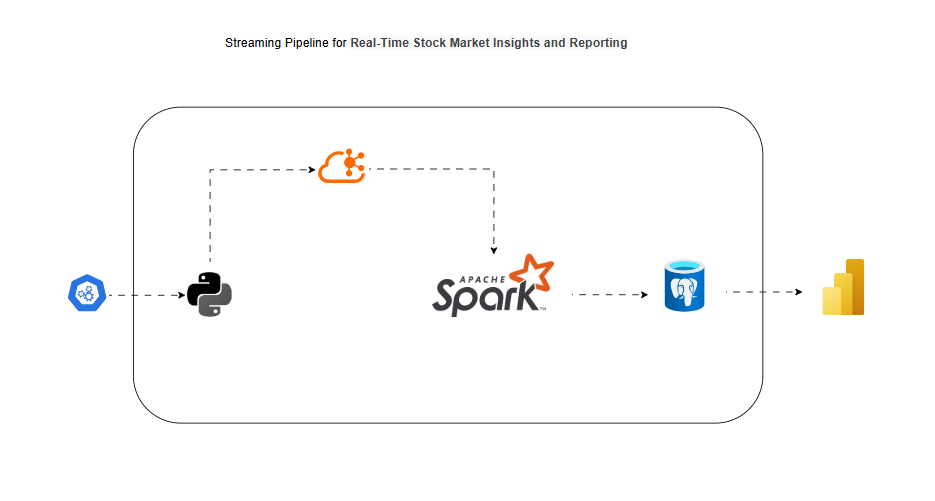

### REAL TIME STOCK MARKET ANALYSIS STREAMING PIPELINE 

In this lightweight streaming pipeline project; a pipeline that extracts stock data from the Alpha Vantage API is implemented, data is streamed with Apache Kafka and processed with Spark with the processed data loaded into a postgres database. 

All services are containerized with Docker for easy deployment. 


[Data Source](https://rapidapi.com/alphavantage/api/alpha-vantage/playground/apiendpoint_55220bb2-8a64-4cde-89e1-87ec00947f57)


### PIPELINE ARCHITECTURE





### Project Tech Stack and Flow
- `Kafka UI : For inspecting topics and messaging`
- `API : produces JSON events into kafka`
- `Spark : consumes from kafka and writes to postgres`
- `pgAdmin : manage postgres visually`
- `Postgres : Stores results for analytics`
- `Power BI ; connects to postgres for data visualization/analytics`


### Project Setup

#### Clone the repo
  ```bash
    #Clone the repo
    git clone https://github.com/Kunleweb/streaming-pipeline-for-stock-data-market-pulse-
    
    #Navigate to the project directory
    cd streaming-pipeline-for-stock-data-market-pulse-
  ```

#### Setup Environment Variables 
  ```bash
    # Create a .env file in project root directory

    ## get your API key from the api data source mentioned above
    API_KEY=ADD API KEY
    POSTGRES_USER=admin
    POSTGRES_PASSWORD=admin
    PGADMIN_DEFAULT_EMAIL=sample@admin.com
    PGADMIN_DEFAULT_PASSWORD=admin
  ```

#### Create And Activate The Virtual Environment
  ```bash
    python -m venv venv
    source venv/Scripts/activate
  ```

#### Install Project Dependencies
  ```bash
    pip install -r requirements.txt
  ```

#### Run The Docker Services
  ```bash
    docker compose up -d
  ```

#### Connect To The Postgresql Database Server From Pgadmin
  ### Connect To Kafka Server From The Kafka Client 
  ```bash
    ## pgadmin: Create your database and tables with the client: (dbname: stock_data, db_table:stocks)
    localhost:5050

    ## kafka-ui 
    localhost:8085
  ```

### Run The Python Producer Script To Send Data To Kafka
  ```bash
    python producer/main.py
    ## Login to the kafka ui client to see the messages pushed to kafka: ( topic name - stock_analysis )
  ```

### Inspect The Consumer Script: Read Data From Kafka And Load To Postgres
  ```bash
    ## Login to Docker Desktop, locate the name of the project container, expand it and click on the consumer service  (Inspect the logs). This is now sending data to your postgres database

    ## Login to the pgadmin client and check the messages now streamed into the (stock_data:stocks) database table. 
    ## You need to run the `SELECT * FROM Table` query
  ```


### Shut Down Server
  ```bash
    docker compose down -v
  ```